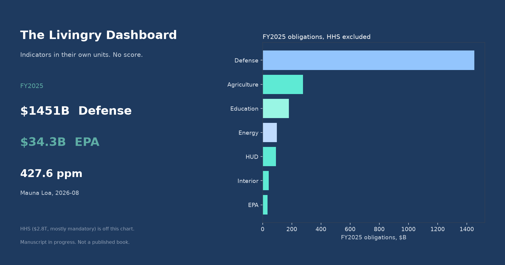
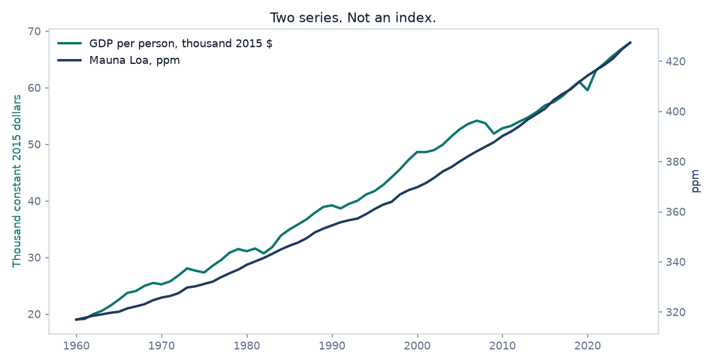

# The Livingry Dashboard

**What do the public numbers say if you refuse to collapse them into one score?**

This is the working instrument for *The Livingry Protocol*, an unpublished manuscript.
Chapter 29 argues that a dashboard beats an index, because an
index hides its weights. Chapter 1 argues that the United States already produces enough,
and that the binding constraint is design. This repo pulls the public series those chapters
depend on, checks the claims against the pull, and leaves the gaps listed.

It is not a published book, and it does not compute a Livingry score.



## The pull, 29 September 2026

| Check | What the sources say |
|---|---|
| Defense vs EPA, FY2025 obligations | $1,451.3B vs $34.3B, 42 to 1. Same kind of number. |
| Defense vs Agriculture, EPA, HUD, and Interior | $1,451.3B vs $444.3B, 3.3 to 1. The group is an author grouping, written as a formula in the workbook. |
| HHS | $2,794.3B, mostly Medicare and Medicaid. Shown, and not added into the group. |
| Largest Lockheed registration vs EPA | UEI G4KDGE4JFFK7, $34.1B, next to EPA's $34.3B. Two other Lockheed registrations ($10.4B, $6.1B) are listed and not summed. A contractor's receipts and an agency's obligations are different kinds of quantity. |
| US food, 2023 | 3,947 kcal per person per day, and 10.3% moderate or severe food insecurity. Coexistence, not a cause. |
| US undernourishment | FAO publishes `<2.5`, a floor, in 24 years of this pull. That is not a measured rate. |
| GDP beside CO2 | US GDP per person $39,200 (1990) to $67,946 (2025, constant 2015 dollars). Mauna Loa annual mean 354.5 ppm (1990) to 427.3 ppm (2025). Latest month: 427.55 ppm in August 2026. |
| World hunger beside the same stock | Undernourishment 12.8% (2000) to 7.5% (2019). FAO marks 2020-2025 as projections. The stock rose anyway. |
| Land per 100g protein | Lamb and mutton 184.8 m2, farmed prawns 2.01 m2. Beef herd 163.6 m2 against tofu 2.2 m2. Poore and Nemecek 2018, not a live feed. |
| Military expenditure | 3.12% of US GDP in 2025 (SIPRI). Not combined with the obligation figures. |

The FY2025 obligation figures match the pull archived for Chapter 1 on 25 August 2026.
That is the point of a refresh: the manuscript's numbers are still the source's numbers.



The two lines use separate axes. They rise over the same decades. They are not subtracted
from each other, and the chart is titled that way on purpose.

## What it refuses

- A single score. Chapter 29 says the weights would be the political act, hidden in a formula.
- Vacant homes versus homeless people. Chapter 1 calls that fungibility nonsense.
- Restoration rates, rivers cleaner downstream than upstream, unpaid care hours, and
  case-remedy times. Chapter 29 asks for them. No public feed here measures them, so they
  are named in `not_measured` instead of approximated.

## Run it

```bash
make setup
make refresh     # USAspending, World Bank, UN SDG, NOAA, Our World in Data. No keys.
make build       # extracts, claims, quality log. Fails if a check fails.
make workbook    # reports/livingry_dashboard.xlsx, eight tabs, the grouping as a formula
make figures
make tableau     # tableau/livingry_dashboard.twbx, open in Tableau Public
make app         # Streamlit on localhost
make test
```

`make refresh` raises if a source fails. A missing feed is not allowed to become a missing claim.

## Repository

| Path | What |
|---|---|
| `src/livingry/fetch.py` | Public pulls, no credentials |
| `src/livingry/build.py` | Tables, claim verdicts, quality checks |
| `src/livingry/workbook.py` | Excel workbook |
| `src/livingry/figures.py` | Cover and the GDP/CO2 chart |
| `src/livingry/tableau_workbook.py` | Tableau Public workbook |
| `app/streamlit_app.py` | Reader for the committed extracts |
| `docs/METHODOLOGY.md` | Units, caveats, and the things left out |
| `tableau/exports/` | The extracts |

Built by [Jason Pellerin](https://www.jasonpellerin.com). Data: USAspending.gov, World Bank,
UN SDG API, NOAA Global Monitoring Laboratory, Our World in Data (FAO, SIPRI, Global Carbon
Project, Poore and Nemecek). MIT license.
